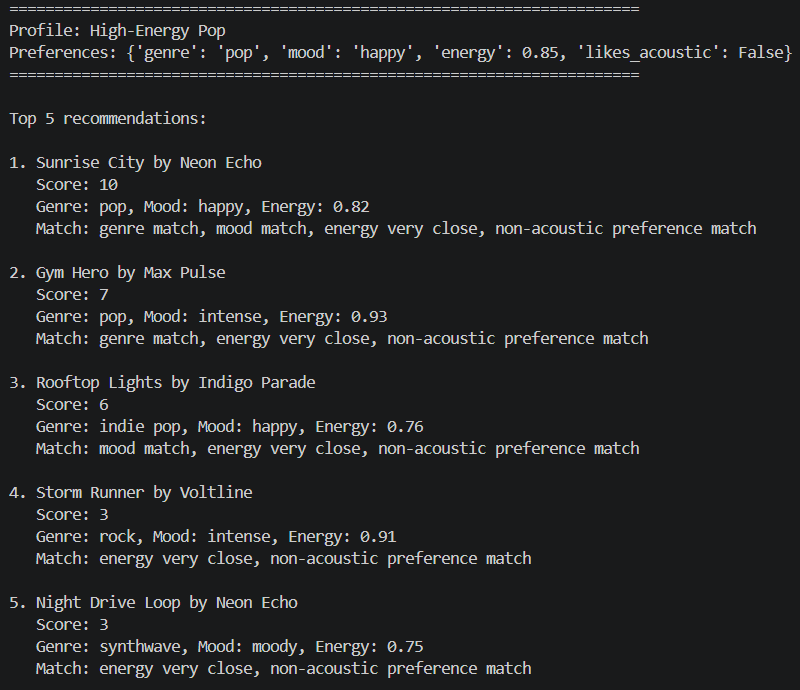
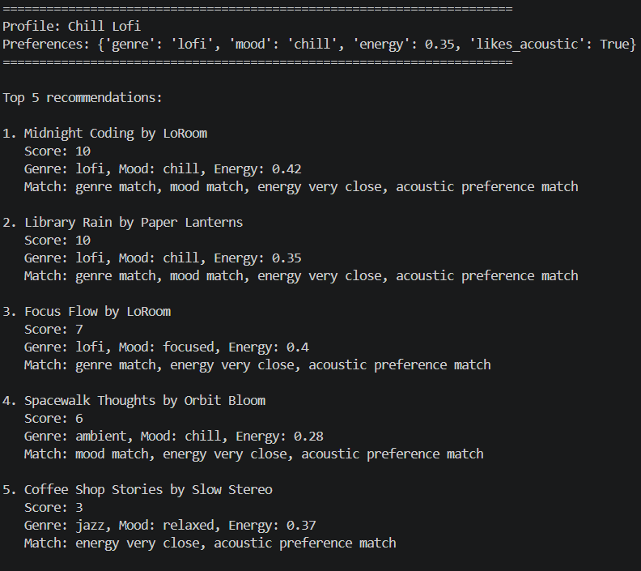
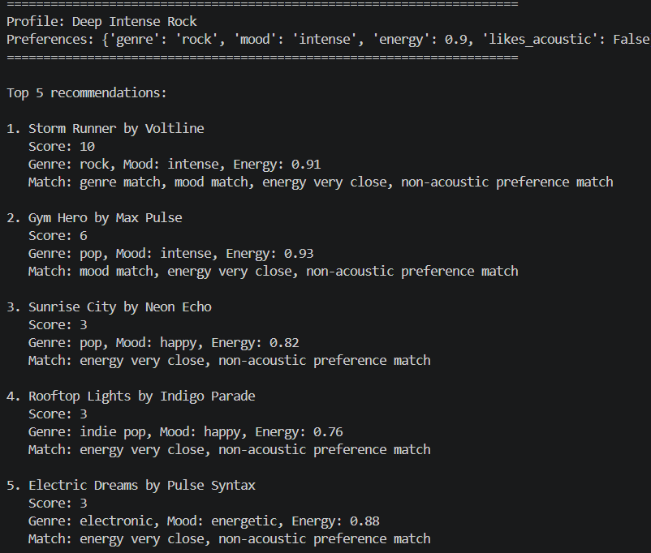
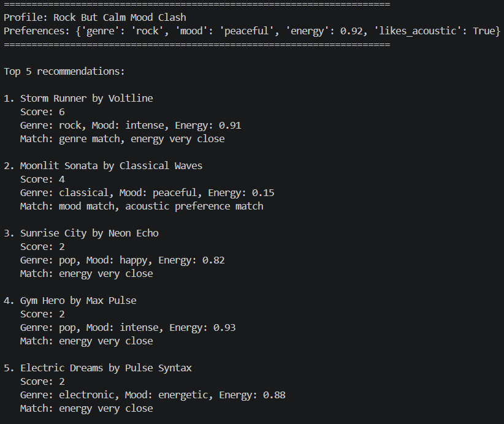
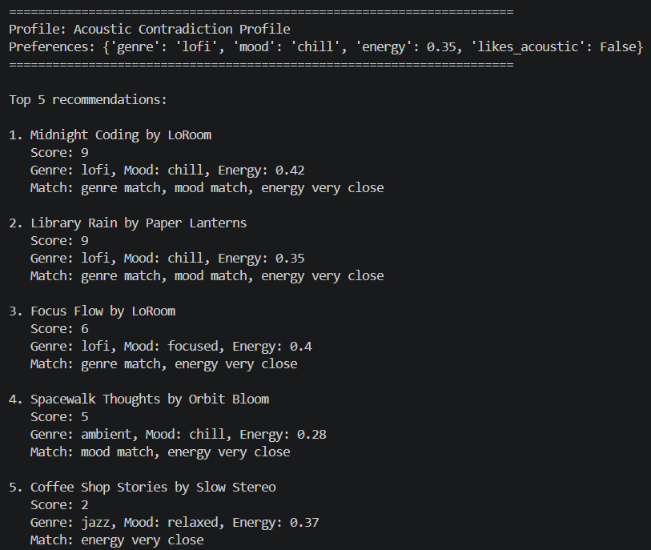

# 🎵 Music Recommender Simulation

## Project Summary

In this project you will build and explain a small music recommender system.

Your goal is to:

- Represent songs and a user "taste profile" as data
- Design a scoring rule that turns that data into recommendations
- Evaluate what your system gets right and wrong
- Reflect on how this mirrors real world AI recommenders

Replace this paragraph with your own summary of what your version does.

---

## How The System Works

Real-world recommendation systems combine many signals, such as user history, item similarity, and behavior from similar users, then continuously re-rank results based on feedback. In this simulation, I will prioritize transparent, content-based matching so it is easy to explain why a song was recommended, with the strongest emphasis on genre and mood fit, then energy closeness and acoustic preference.

Features used in this simulation:

- Song features: genre, mood, energy, acousticness, tempo_bpm, valence, danceability.
- UserProfile features: favorite_genre, favorite_mood, target_energy, likes_acoustic.

This recommender follows a simple Input -> Process -> Output pipeline.

1. Input (User Preferences + Song Catalog)
- User preferences represent taste, such as preferred genre, mood, and target energy.
- Songs are loaded from data/songs.csv.
- Each song includes attributes like genre, mood, energy, tempo_bpm, valence, danceability, and acousticness.

2. Process (Score Each Song in a Loop)
- The system iterates through every song in the catalog.
- For each song, it compares song attributes to the user preferences.
- The scoring logic combines these comparisons into one numeric score.
- For transparency, the system can also store a short explanation with each score.

3. Output (Rank and Return Top K)
- After all songs are scored, the full list is sorted from highest score to lowest score.
- The top K songs are selected as the final recommendations.
- The output is a ranked recommendation list.


## My User Profile Recommendations
  


## Other User Profiles Recommendations
<div style="display:flex">
   
   
   
   
   
</div>

---

## Getting Started

### Setup

1. Create a virtual environment (optional but recommended):

   ```bash
   python -m venv .venv
   source .venv/bin/activate      # Mac or Linux
   .venv\Scripts\activate         # Windows

2. Install dependencies

```bash
pip install -r requirements.txt
```

3. Run the app:

```bash
python -m src.main
```

### Running Tests

Run the starter tests with:

```bash
pytest
```

You can add more tests in `tests/test_recommender.py`.

---

## Experiments You Tried

**Swapped the weights for genre and mood matching (Experiment 1)**
   - Changed genre match from +4 → +2
   - Changed mood match from +3 → +4
   - **Result:** Mood became the dominant factor. Songs that matched the user's mood preference now ranked higher even if the genre didn't align perfectly. For example, "Gym Hero" (intense mood, pop genre) ranked higher in the High-Energy Pop profile because it prioritized mood over genre. This experiment showed how weighting preferences directly influences which songs bubble to the top.


   - **High-Energy Pop:** Most balanced "mainstream upbeat" profile. It consistently pulls happy, high-energy songs, with "Sunrise City" as a strong all-around match.
   - **Chill Lofi:** Most consistent profile overall. It gets many exact matches (genre + mood + energy + acoustic), so scores are high and rankings feel very stable.
   - **Deep Intense Rock:** Most aggressive high-energy profile. It stands out by prioritizing intense mood and non-acoustic tracks, often surfacing rock/adjacent workout songs.
   - **Rock But Calm Mood Clash:** Most conflicted profile. It mixes rock + peaceful + very high energy + acoustic, so results look less coherent and reveal trade-offs in the scoring logic.
   - **Ultra-Low Energy Party Ask:** Most unrealistic combination. It asks for very low energy plus energetic mood, so after one strong exact genre/mood match, ranking quality drops quickly.
   - **Acoustic Contradiction Profile:** Best test of acoustic preference impact. It is close to Chill Lofi but flips likes_acoustic to False, showing how a single preference changes scores without fully changing top songs.
---

## Limitations and Risks

Summarize some limitations of your recommender.

Examples:

- It only works on a tiny catalog
- It does not understand lyrics or language
- It might over favor one genre or mood

You will go deeper on this in your model card.

---

## Reflection

Read and complete `model_card.md`:

[**Model Card**](model_card.md)

Write 1 to 2 paragraphs here about what you learned:

- about how recommenders turn data into predictions
- about where bias or unfairness could show up in systems like this


---

## 7. `model_card_template.md`

Combines reflection and model card framing from the Module 3 guidance. :contentReference[oaicite:2]{index=2}  

```markdown
# 🎧 Model Card - Music Recommender Simulation

## 1. Model Name

Give your recommender a name, for example:

> VibeFinder 1.0

---

## 2. Intended Use

- What is this system trying to do
- Who is it for

Example:

> This model suggests 3 to 5 songs from a small catalog based on a user's preferred genre, mood, and energy level. It is for classroom exploration only, not for real users.

---

## 3. How It Works (Short Explanation)

Describe your scoring logic in plain language.

- What features of each song does it consider
- What information about the user does it use
- How does it turn those into a number

Try to avoid code in this section, treat it like an explanation to a non programmer.

---

## 4. Data

Describe your dataset.

- How many songs are in `data/songs.csv`
- Did you add or remove any songs
- What kinds of genres or moods are represented
- Whose taste does this data mostly reflect

---

## 5. Strengths

Where does your recommender work well

You can think about:
- Situations where the top results "felt right"
- Particular user profiles it served well
- Simplicity or transparency benefits

---

## 6. Limitations and Bias

Where does your recommender struggle

Some prompts:
- Does it ignore some genres or moods
- Does it treat all users as if they have the same taste shape
- Is it biased toward high energy or one genre by default
- How could this be unfair if used in a real product

---

## 7. Evaluation

How did you check your system

Examples:
- You tried multiple user profiles and wrote down whether the results matched your expectations
- You compared your simulation to what a real app like Spotify or YouTube tends to recommend
- You wrote tests for your scoring logic

You do not need a numeric metric, but if you used one, explain what it measures.

---

## 8. Future Work

If you had more time, how would you improve this recommender

Examples:

- Add support for multiple users and "group vibe" recommendations
- Balance diversity of songs instead of always picking the closest match
- Use more features, like tempo ranges or lyric themes

---

## 9. Personal Reflection

A few sentences about what you learned:

- What surprised you about how your system behaved
- How did building this change how you think about real music recommenders
- Where do you think human judgment still matters, even if the model seems "smart"

